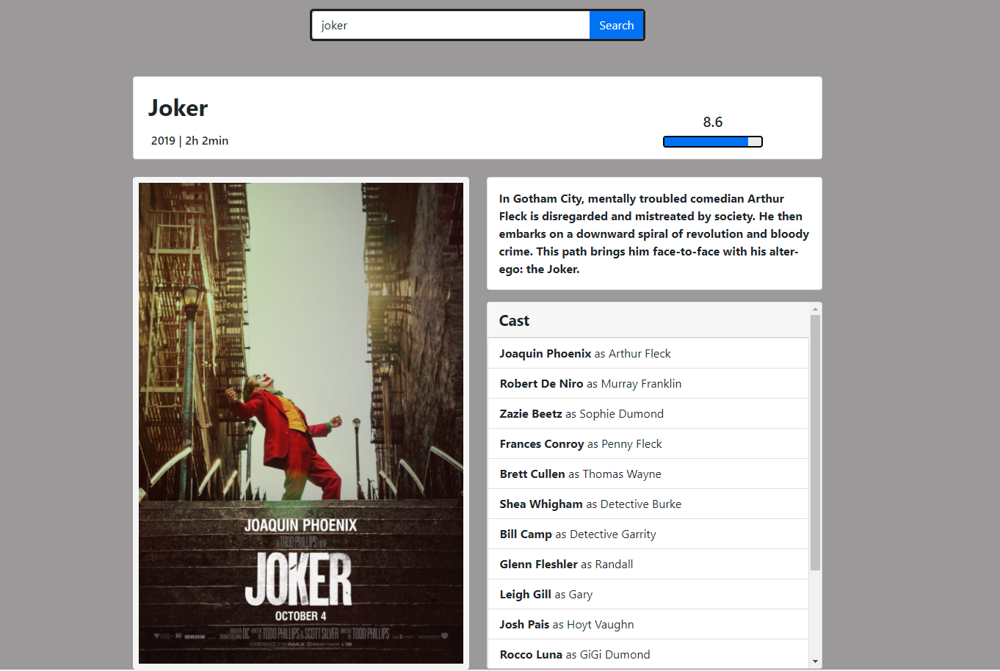

# get-movie-info

https://get-movie-info.herokuapp.com/

My first experience with react and api

The api I used => https://rapidapi.com/SAdrian/api/data-imdb1/

You can search for a movie to get information about it. (year, length, rating, poster, plot, cast)

